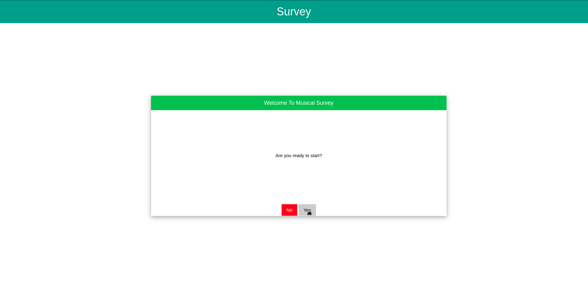

# SurveyApp
Simple Survey App in javascript, using w3css as syle.
NOTE: It is only client side application. The backend is modelled with a json file.
      Look at question.json in ./js/ folder

# Download
Clone this repo or download as zip
```git
git clone https://github.com/giacco/SurveyApp.git
```

and palce the downloaded folder into your webserver root directory

# Demo

